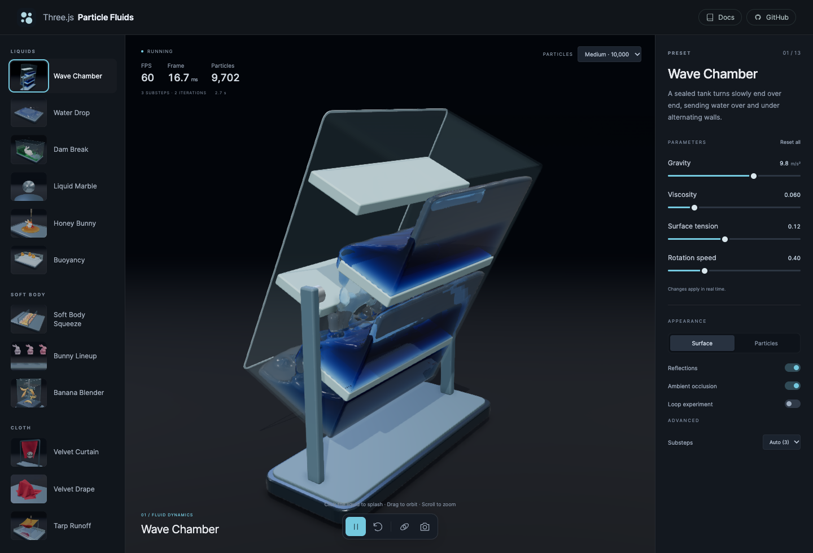

# Three.js Particle Fluids

Interactive particle simulations built with **Three.js, WebGPU, and the Three.js Shading Language (TSL)**. Nine curated presets explore fluid, form, and motion, with live controls and GPU performance diagnostics.



## Run locally

Install **Node.js 22.12 or newer**, then run:

```sh
npm ci
npm run dev
```

Open the localhost URL printed by Vite. All models and textures are bundled. No API keys, accounts, or additional services are needed. The demo makes no external requests.

A desktop browser and GPU with WebGPU support are required. Enable hardware acceleration and serve the app on localhost or HTTPS. The solver requires 1,024 compute invocations per workgroup, a workgroup X size of 1,024, and 10 storage buffers per shader stage. Adapters with lower limits cannot run it. There is no WebGL simulation fallback.

## The collection

| Preset                | Explore                                                                |
| --------------------- | ---------------------------------------------------------------------- |
| **Tidal chamber**     | Waves spilling over low weirs and through staggered wall gaps          |
| **Crown impact**      | A falling drop splashing into a shallow pool                           |
| **Liquid marble**     | Inward gravity, surface tension, and droplets pulled off by clicking   |
| **Honey bunny**       | A circling nozzle drizzles viscous honey over the Stanford bunny       |
| **Buoyancy**          | Textured rubber ducks floating or sinking as their density changes     |
| **Soft Body Squeeze** | 20 textured CC0 forms squeezed between closing plates                  |
| **Cloth**             | Soft red velvet displaced by a moving chrome sphere                    |
| **Vortex plume**      | Lit volumetric smoke with filtered density and correct scene occlusion |
| **Smoke bubbles**     | Smoke-filled bubbles rise through water and burst into drifting puffs  |

Each preset has a focused parameter panel. Sliders apply immediately; controls marked **↻** restart the experiment when released. Settings are remembered per preset during the current session. **Reset all** restores that preset's defaults.

- **Space** pauses or plays; **R** restarts. Shortcuts do not intercept focused controls.
- **Drag** to orbit, **right-drag** to pan, and **scroll or pinch** to zoom.
- **Surface / Particles** reveals the simulation beneath the rendering. In Vortex plume, Particles also reveals the carrier fluid.
- The **Particles** menu in the viewport's upper-right corner sets the particle budget: Low (5,000), Medium (10,000), High (15,000), Ultra (25,000), or Max (50,000). Presets resize their particles to fill the same volume with that count; Soft Body Squeeze splits it across its 20 bodies. Changing it restarts the scene.
- **Ambient occlusion** adds contact shading and depth to creases. Disable it under Appearance to reduce rendering cost.
- **Loop experiment** (off by default) replays a study after its duration.
- **Click the liquid** to apply a local impulse. In Liquid marble, this pulls a cap outward into droplets. Focus the viewport and press **Enter** for a center-screen impulse. Successful interactions resume playback.
- **Save image** downloads a PNG of the current viewport.
- On smaller screens, open **Parameters** to access the controls.

The selected preset is reflected in the URL, for example `?preset=liquid-marble`. Reduced-motion preferences start the simulation paused. Background tabs suspend simulation time.

The upper-left overlay reports rendered FPS, frame interval, active particle count, simulation time, and solver settings. Gas counts include both carrier particles and live tracers. Frame time measures the interval between rendered frames, including GPU completion; it is not an isolated GPU kernel benchmark. Under sustained load, the simulation limits catch-up work and may advance more slowly than real time.

## Project layout

One npm project, with engine code and demo code kept separate:

```text
src/
  core/       Particle buffers, integration, constraints, contacts, colliders
  fluids/     Fluid solver, viscosity diffusion, and ray-marched surface rendering
  softbody/   Soft and rigid body solvers, voxelization, mesh skinning
  cloth/      Cloth constraints and smooth bicubic surface rendering
  gas/        Tracer advection, volumetric smoke, and diagnostic sprites
  render/     GPU-driven particle rendering
  sdf/        CPU mesh-to-SDF baking and binary utilities
  index.ts    Engine exports
demo/
  presets/    Nine presets and their controls
  runtime/    Scene lifecycle, lighting, ambient occlusion, and camera
  assets/     CC0 source meshes used by the demo
  main.ts     Preset list and parameter interface
  style.css   Responsive interface styles
public/       Local models, particle templates, icons, and preset previews
tests/        Numerical tests and GPU benchmark harness
```

The engine is source code in this repository, not a published npm package. Import from `src/index.ts` or an individual module when integrating it. Start with `demo/presets/liquids.ts` for a complete example of particle allocation, a fluid material, colliders, a simulation loop, and surface rendering. The demo runtime handles device initialization and resource disposal.

The buoyancy preset uses coupled fluid pressure for vertical support and a torque-only weighted-base approximation to keep the toy ducks upright. Increasing their relative density above water still makes them sink.

The public API is experimental and may change. The soft-body solver and screen-space fluid renderer have numerical and rendering limitations; this project is intended for interactive visualization, not engineering analysis.

## Development

| Command                  | Purpose                                                  |
| ------------------------ | -------------------------------------------------------- |
| `npm run dev`            | Start the local demo                                     |
| `npm run build`          | Type-check and build the demo into `dist/`               |
| `npm run preview`        | Serve the production build locally                       |
| `npm run typecheck`      | Check engine, demo, and test types                       |
| `npm run assets:elastic` | Rebuild smoothed CC0 meshes and exact particle templates |
| `npm run lint`           | Lint engine, demo, and scripts                           |
| `npm test`               | Run CPU tests                                            |
| `npm run test:gpu`       | Run numerical WebGPU tests using installed Google Chrome |
| `npm run test:demo`      | Run browser checks for presets and application controls  |
| `npm run test:perf`      | Run local GPU benchmarks and create a report             |
| `npm run bench:baseline` | Record a local benchmark baseline                        |

GPU checks require a compatible local GPU. The test runner passes Chrome's `--enable-unsafe-webgpu` flag for local testing. Performance results are specific to the browser, adapter, driver, and settings; they are not cross-device guarantees. Benchmark output remains local and is ignored by Git.

A small number of numerical checks are explicitly skipped with explanations in their test files. The suite includes regressions for shape matching that preserves externally applied translations, viscous shear dissipation, and solver convergence. Impact deformation depends on the timestep and iteration budget; local shape matching needs multiple iterations to converge.

## License

[MIT](LICENSE). The bundled Kenney and Poly Haven models are CC0. Asset sources, modifications, and dependency notices are listed in [THIRD_PARTY_NOTICES.md](THIRD_PARTY_NOTICES.md).
