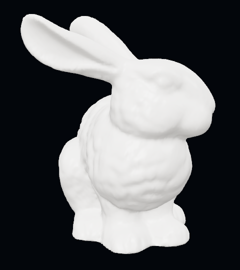
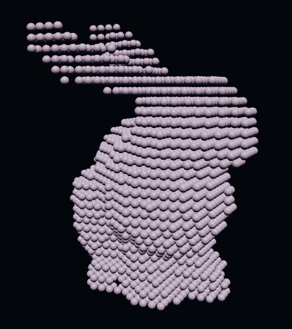

[Docs](README.md) › Guide

# Guide

How to set up a scene with [`Simulation`](api/simulation.md).

1. [Requirements](#requirements)
2. [First scene](#first-scene)
3. [Choosing a particle count](#choosing-a-particle-count)
4. [Using your own meshes](#using-your-own-meshes)
5. [Frame loop](#frame-loop)
6. [Lighting](#lighting)
7. [Combining materials](#combining-materials)
8. [Smoke next to liquid](#smoke-next-to-liquid)
9. [Loading](#loading)
10. [Debugging](#debugging)
11. [Low-level API](#low-level-api)

## Requirements

| Requirement    | Version / note                                                        |
| -------------- | --------------------------------------------------------------------- |
| `three`        | r184 (`0.184.x`)                                                      |
| `@types/three` | `0.184.x` (TypeScript only)                                           |
| Browser        | WebGPU enabled. No WebGL fallback. Served from `localhost` or HTTPS.  |
| Build target   | ES2022+ if you use top-level `await` (Vite: `build.target: 'es2022'`) |

```sh
npm install threejs-particle-fluids three
```

## First scene

This scene drops a block of water into a tank 1 m wide, 0.8 m tall, and 0.6 m deep.

```ts
import { Box3, Box3Helper, DirectionalLight, PerspectiveCamera, Scene, Vector3 } from 'three';
import { PMREMGenerator } from 'three/webgpu';
import { RoomEnvironment } from 'three/addons/environments/RoomEnvironment.js';
import { Simulation, createParticleRenderer } from 'threejs-particle-fluids';

const renderer = await createParticleRenderer({ antialias: true });
renderer.setSize(innerWidth, innerHeight);
document.body.append(renderer.domElement);

const scene = new Scene();
scene.environment = new PMREMGenerator(renderer).fromScene(new RoomEnvironment(), 0.04).texture;
const sun = new DirectionalLight(0xffffff, 2);
sun.position.set(1, 3, 2);
scene.add(sun);

const camera = new PerspectiveCamera(40, innerWidth / innerHeight, 0.01, 50);
camera.position.set(1.6, 1.4, 2.2);
camera.lookAt(0, 0.3, 0);

const container = new Box3(new Vector3(-0.5, 0, -0.3), new Vector3(0.5, 0.8, 0.3));
scene.add(new Box3Helper(container));

const sim = new Simulation({ renderer, scene, camera, container, particles: 5000 });
sim.addFluid({ box: new Box3(new Vector3(-0.5, 0, -0.3), new Vector3(-0.1, 0.5, 0.3)) });

async function frame() {
  await sim.step();
  renderer.render(scene, camera);
  requestAnimationFrame(frame);
}
requestAnimationFrame(frame);
```

Every scene follows the same pattern. Create a `Simulation`, add what you want to it, then call `sim.step()` before each render. You can add [liquid](api/fluid.md), [soft bodies](api/softbody.md), [cloth](api/cloth.md), [smoke](api/smoke.md), and [obstacles](api/simulation.md#addflooroptions). The simulation adds its own meshes to your scene, so there's nothing else to draw.

A runnable version is in [`examples/fluid.ts`](../examples/fluid.ts).

## Choosing a particle count

`particles` is the total number of particles in the simulation. More particles give finer detail but make every frame slower, so use the lowest number that looks good. 5,000 is a reasonable place to start. Test on the slowest device you plan to support.

All particles are the same size, so big objects get more of them than small ones. In a large tank of water, a small soft body might get only a few dozen particles and look blocky. The console warns you when this happens, and each object's `particleCount` shows how many it got.

To set the particle size yourself, pass `particleRadius` in metres instead of `particles`.

## Using your own meshes

`addSoftbody`, `addFluid({ mesh })`, and `addMesh` all take an ordinary three.js mesh. The first two turn it into particles when the simulation starts. The mesh's bounding box is filled with a grid of particles, one particle width apart, and every grid point inside the mesh is kept.

<p>
  
  
</p>

The Stanford bunny as it's drawn (left) and as the particles that simulate it (right), with a budget of 6,000 particles.

For this to work, the mesh has to be closed, with no holes in its surface. Parts thinner than about one particle width fall between grid points and disappear. A soft body keeps only its largest connected piece, so a separate hat or eye is dropped.

A soft body doesn't draw its particles. The simulation hides your mesh and draws a copy that bends with them, where each vertex follows its four nearest particles. The surface keeps all of its detail, even when the particles behind it are coarse.

`addMesh` works differently. It doesn't make particles. It turns the mesh into a solid obstacle, which follows the mesh as you move it.

Filling and baking meshes happens on the CPU when the simulation starts. Detailed meshes make loading slower but don't affect the frame rate after that.

## Frame loop

Call `await sim.step()` once per frame, before `renderer.render()`. Without an argument, `step()` runs as many 1/60 s steps as the time since the last frame calls for, up to four. The simulation runs at the same speed on 60 Hz and 120 Hz displays.

`sim.step(1 / 60)` advances exactly one step, however long the frame took. Use it when recording video or in tests. Don't pass the frame's elapsed time, because steps of changing length make the simulation less stable.

To pause, stop calling `step()`. When you start again after more than 250 ms, the simulation carries on from where it was instead of trying to catch up.

## Lighting

Liquid reflects `scene.environment`, so set one or the water will look flat. It takes its highlight from a directional light, preferring one that casts shadows.

Soft bodies and cloth are ordinary lit meshes, so they need lights like anything else in your scene.

## Combining materials

Liquid, soft bodies, cloth, and obstacles in the same simulation all push on each other. There's nothing to set up.

```ts
const sim = new Simulation({ renderer, scene, camera, container, particles: 5000 });
sim.addFluid({ box: water });
sim.addSoftbody({ mesh: ball, density: 400 }); // floats
sim.addSoftbody({ mesh: cube, density: 2000 }); // sinks
sim.addSphere({ radius: 0.1, follow: paddle }); // moves with the paddle mesh
```

Place soft bodies and cloth inside the container, away from obstacles and each other. Liquid fills in around them. See [`examples/floating.ts`](../examples/floating.ts) and [`examples/cloth.ts`](../examples/cloth.ts).

## Smoke next to liquid

Smoke can't share a simulation with liquid, soft bodies, or cloth. To have both in one scene, create a second simulation for the smoke and step both each frame:

```ts
const smokeSim = new Simulation({
  renderer,
  scene,
  camera,
  container: new Box3(new Vector3(1, 0, -0.5), new Vector3(2, 1.9, 0.5)),
  particles: 5000,
});
smokeSim.addSmoke();

async function frame() {
  await sim.step();
  await smokeSim.step();
  renderer.render(scene, camera);
  requestAnimationFrame(frame);
}
```

## Loading

The first step does the setup work: it fills meshes with particles, bakes obstacles, and compiles shaders. This blocks the page, so show a loading screen first and give the browser time to draw it:

```ts
showLoadingScreen();
await new Promise(requestAnimationFrame);
await new Promise(requestAnimationFrame);
await sim.start();
await sim.step(1 / 60);
renderer.render(scene, camera);
hideLoadingScreen();
```

## Debugging

To see what's being simulated, draw the particles instead of the surfaces:

```ts
sim.showParticles = true;
```

This shows whether a mesh filled the way you expected and whether anything is passing through something else.

| Problem                                   | Fix                                                                                                                    |
| ----------------------------------------- | ---------------------------------------------------------------------------------------------------------------------- |
| Nothing shows up                          | Await `step()` before rendering. Units are metres, so check the camera distance. Add a `container` or `addFloor()`.    |
| Liquid looks flat                         | Set `scene.environment`.                                                                                               |
| Liquid disappears as it spreads           | Make the `container` cover everywhere the liquid can go.                                                               |
| Things pass through obstacles             | Make the obstacles thicker or slower, or raise `substeps`.                                                             |
| Liquid looks springy                      | Raise `substeps`.                                                                                                      |
| Soft bodies are blocky or lose thin parts | Raise `particles`, or use less liquid around them.                                                                     |
| Cloth leaks liquid                        | Raise the cloth's `weight`.                                                                                            |
| Frames are slow                           | Lower `particles` or `substeps`, and cap the pixel ratio with `renderer.setPixelRatio(Math.min(devicePixelRatio, 2))`. |

Every error message is listed under [Simulation › Errors](api/simulation.md#errors).

## Low-level API

`Simulation` is built from classes that are also exported. Use them when you need something it doesn't offer, such as pouring liquid in over time, custom forces, rigid bodies, or your own renderers.

```ts
const particles = new ParticleSystem(renderer, init.length, radius);
particles.uploadParticles(init);
const fluid = new FluidSystem(particles, { viscosity: 0.02 });
const walls = new PrimitiveSet(particles);
walls.addPlane(new Vector3(0, 1, 0), new Vector3(0, 0, 0));
const loop = new SimLoop(particles, { substeps: 3, materials: [fluid], colliders: [walls] });
await loop.step(1 / 60);
```

Start with the [Core](api/core.md) reference. [`examples/low-level.ts`](../examples/low-level.ts) is a complete scene, and the demo presets in [`demo/presets/`](../demo/presets) are larger ones.

If you only need one setting that `Simulation` doesn't expose, you can reach the objects it built after `start()`. They are `sim.particleSystem`, `sim.loop`, `fluid.fluidSystem`, `fluid.surface`, `softbody.softbodySystem`, `cloth.clothSystem`, and `smoke.gasSystem`.
